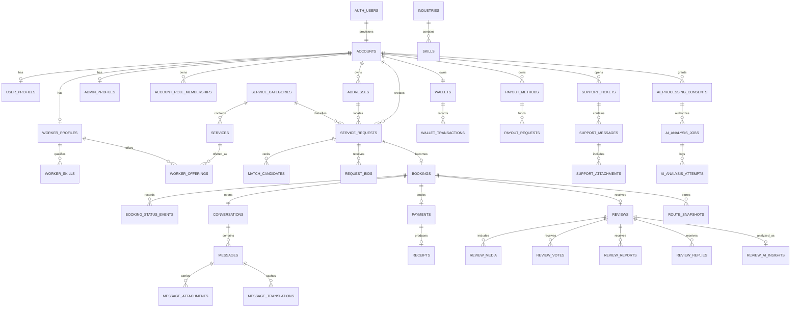
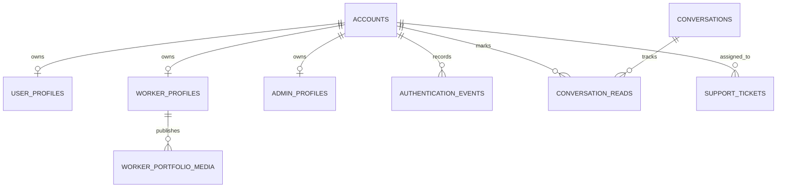

# Database Design

## Design principles

The hosted Supabase schema is authoritative. Existing IDs/tables were retained. New domains are additive and normalized. Business state changes use row locks, constraints, idempotency, append-only ledgers/events, and fixed-search-path functions. All new application tables have RLS; service-role access is reserved for validated Edge/background work.

## Core ERD

## Additive tables

| Domain | Tables | Key constraints/relationships |
| --- | --- | --- |
| Catalog | `industries`, `skills`, `services`, `worker_offerings` | Unique slugs/worker-service; category/industry foreign keys; active flags; price bounds |
| Marketplace | `request_bids` | Unique active worker/request intent; positive minor amount; bounded duration/status |
| Wallet | `wallets`, `wallet_transactions`, `payout_methods`, `payout_requests` | One wallet/account; nonnegative balances; immutable transactions; idempotency keys |
| Support | `support_messages`, `support_attachments` | Ticket/message ownership; UUID Storage path |
| Reviews | `review_votes`, `review_reports`, `review_replies`, `review_ai_insights` | Unique vote/account/review; human moderation remains baseline authority |
| Campaigns | `notification_campaigns`, `notification_deliveries` | Creator/recipient keys; delivery status metrics |
| Reference | `cancellation_reasons` | Unique stable code and audience |
| AI | `ai_processing_consents`, `ai_analysis_jobs` plus extended attempts | Consent version/provider list; owner/idempotency; durable states/results |
| Geospatial | `geocoding_cache`, `route_snapshots` | Hash/expiry cache; booking/requester; GeoJSON/meters/seconds/geography points |

## Important baseline tables retained

`accounts`, profiles, role memberships/session roles, permissions, `service_categories`, `worker_skills`, `worker_availability`, `worker_verifications`, `addresses`, `service_requests`, `match_candidates`, `bookings`, status events, conversations/participants/messages/attachments/translations, tracking updates, payments/receipts/refunds, reviews/media, notifications, support tickets, audit logs, report exports, content pages, system settings, trash entries, and AI analyses/attempts.

## PostGIS

- `addresses.location`, request service location, worker service origin, tracking, and route endpoints use SRID 4326 geography points.
- GiST indexes support `ST_DWithin` eligibility and `ST_Distance` ranking.
- Route providers receive `[longitude, latitude]`; client map props map back to named latitude/longitude.
- `save_geocoded_address` validates Philippine bounds and writes normalized text/point together.

## Indexes

Composite indexes cover common owner/status/date queries for bids, payouts, campaigns/deliveries, support, AI jobs, and routes. Unique indexes protect slugs, idempotency keys, vote identity, and wallet ownership. Spatial GiST indexes cover geography columns. Existing foreign-key/status indexes remain authoritative.

## Constraints and integrity

- Enumerated/check-constrained lifecycle states.
- Positive budgets/amounts and bounded text/duration/media sizes.
- Foreign keys use deliberate cascade/restrict/set-null behavior.
- Wallet mutation trigger rejects update/delete of ledger rows.
- Worker wallet credit trigger fires once after successful payment transition.
- Security functions lock mutable rows and check owner, role, membership, status, AAL, and expected transition.
- Storage policies require `split_part(path,'/',1)=auth.uid()`.

## RLS model

| Principal | Access |
| --- | --- |
| Anonymous | Active public taxonomy/content only |
| Customer | Own profile/address/request/payment/review/notification/support; participant booking/chat |
| Worker | Own worker/verification/offering/wallet/payout; eligible jobs/bids; participant booking/chat |
| Administrator | Operational reads; writes through permission/AAL functions |
| Background/service role | Validated Edge/report/provider workflows; bypass must not be exposed to clients |

## Migration strategy and evidence

- Seven timestamp versions represent the pulled hosted baseline.
- Incompatible local drafts were archived and never pushed.
- Three additive 20260721 migrations were reset/linted locally and deployed.
- Local smoke tests create/delete a disposable user and verify Auth, Edge API, RLS isolation, and Storage ownership.
- Post-deployment migration-to-linked diff for `public,private` is empty.
- Future changes require a new timestamped migration; do not edit deployed files.

## Seed data

`supabase/seed.sql` upserts stable service categories only. Migrations idempotently seed normalized reference taxonomy/settings/cancellation reasons. No users, jobs, bookings, messages, payments, reviews, wallet entries, or AI results are seeded.
## Real-profile schema extension

`accounts.profile_completed_at` distinguishes verified real input from legacy placeholder profiles. `admin_profiles` persists given name, family name, location, bio, and avatar path. `authentication_events` stores server-observed IP/user-agent and a one-way session identifier hash. Storage object paths and portfolio rows are constrained to the owner UUID.

`on_auth_user_confirmed` synchronizes confirmed Auth email/status changes into `accounts`; this prevents a real profile from becoming unreachable through a stale `PENDING_VERIFICATION` state.
