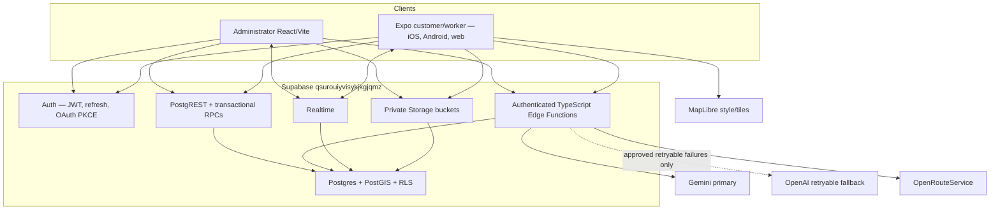
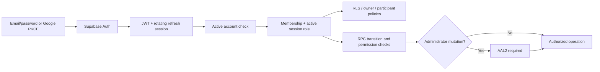
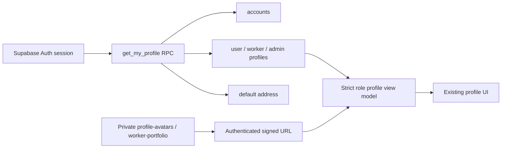

# System Architecture

## Overview

## Frontends

The administrator is a standalone React/Vite application. The unified Expo application projects either customer or worker routes according to the active database role. UI structures remain approved and unchanged except the mandatory AI consent control. View-model adapters isolate database row vocabulary from components.

Expo sessions use AsyncStorage, PKCE, deep links, and AppState refresh. Zustand holds UI/auth/request projections. React Query/Supabase subscriptions hold remote state. The administrator uses a Supabase-backed Auth context and data service.

## Backend and database

Supabase provides:

- Auth identities/sessions, email verification/recovery, Google provider integration.
- PostgREST for policy-protected reads and simple writes.
- PL/pgSQL RPCs for state transitions, locking, idempotency, audit, matching, wallet, payouts, notifications, and administrator operations.
- PostGIS geography points/GiST indexes for service radius and distance.
- Realtime for AI jobs, bookings, bids, chat, notifications, wallets, support, reports, and operations.
- Storage with private UUID-owned paths.
- Edge Functions for provider secrets, multimodal AI, geocoding/routing, reporting, and compatibility APIs.

## Authentication and authorization

The provisioning trigger defaults absent social metadata to `USER`. It accepts only `USER`/`WORKER` self-registration metadata; `ADMIN` requires the protected bootstrap path. Same-email identity linking is delegated to Supabase Auth/provider configuration and must be acceptance-tested after Google credentials are supplied.

## AI services

`ai-analyze-request` validates consent, account, quota, idempotency, and metadata before inserting a queued job. `ai-process-job` validates ownership, loads owner-scoped media, runs Gemini, validates strict JSON, applies retry rules, and calls OpenAI only after two retryable Gemini failures. The result is checked against live category/service IDs and price bounds, persisted using `persist_ai_analysis`, and published through Realtime.

Translation and review insights use the same Gemini-primary/OpenAI-fallback provider utility, preserve originals, and never make authorization/moderation decisions. Provider attempts store outcome, latency, retryability, model, reference/correlation IDs, and usage metadata without keys or media copies.

AI remains feature-disabled until credentials/evaluation gates pass.

## Geospatial services

OpenRouteService keys exist only in Edge secrets. Search is debounced client-side and validated/cached/rate-limited server-side. Provider features normalize into address parts, label, confidence, and coordinates. `save_geocoded_address` writes the normalized text and PostGIS point in one function. Routes store GeoJSON, meters, seconds, start, and destination with `[longitude, latitude]` provider order.

MapLibre renders client-side maps. OpenFreeMap Liberty is the initial non-secret style and can be changed by environment/system setting.

## Storage

Private buckets include service request media, review media, verification documents, chat attachments, support attachments, and report exports. Paths begin with the authenticated UUID. RLS and bucket configuration enforce ownership, purpose-specific MIME types, and maximum sizes. Edge/administrator service-role access is limited to validated workflows.

## Middleware/security layers

1. TLS and Supabase gateway JWT verification.
2. Allowlisted CORS for browser callers.
3. Current user/account/role/permission/AAL checks.
4. Input/media/range/idempotency/rate/quota checks.
5. RLS and fixed-search-path transactional functions.
6. Private Storage policies.
7. Audit/provider-attempt/state-event records.
8. Feature flags and human decisions for AI/safety/moderation.

## Deployment topology

Local development uses Supabase CLI/Docker. Production uses hosted project `qsurouiyvisykjkgjqmz`. The authoritative hosted baseline is represented by the first seven migration versions; three additive production migrations extend it. Edge Functions are deployed with `--use-api` in this environment.
## Profile data flow

Identity values never originate from UI constants. Security-definer RPCs use a fixed search path, `auth.uid()`, bounded inputs, and explicit authenticated grants.
