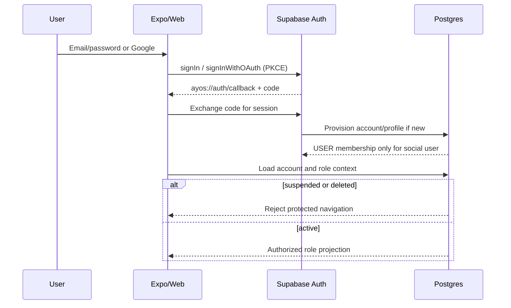
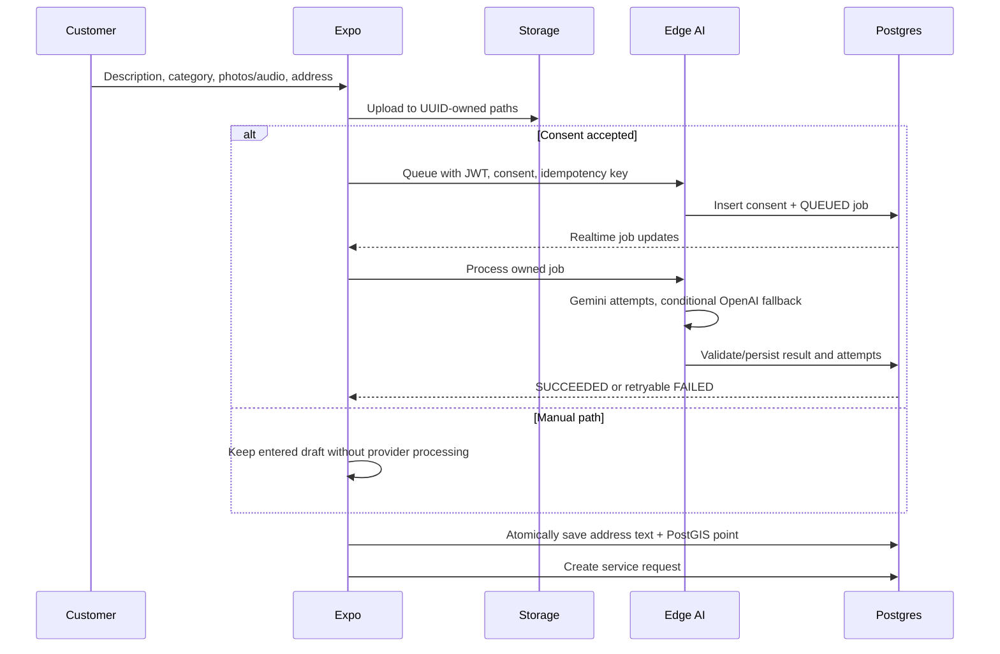
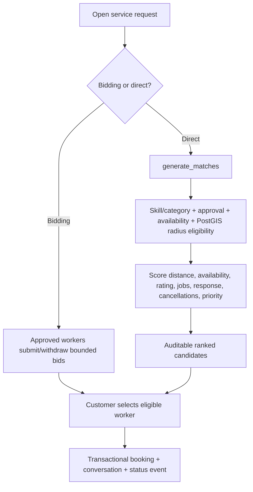
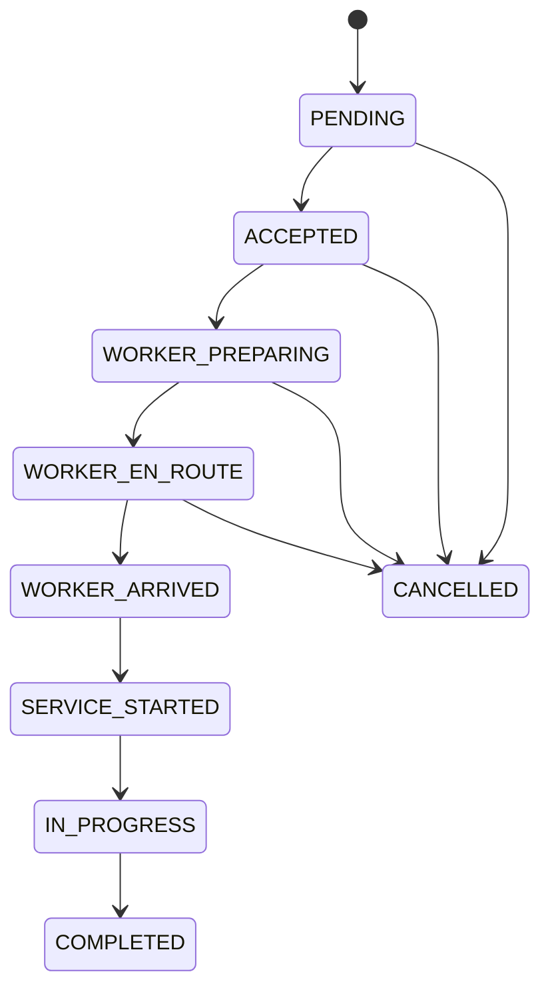
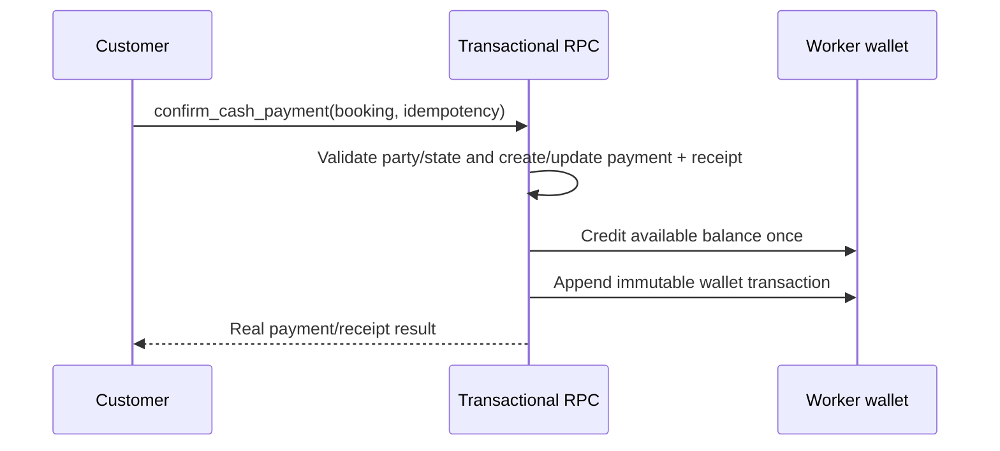
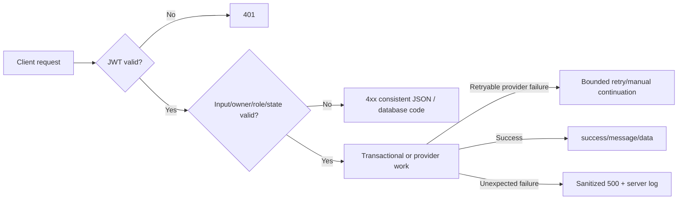
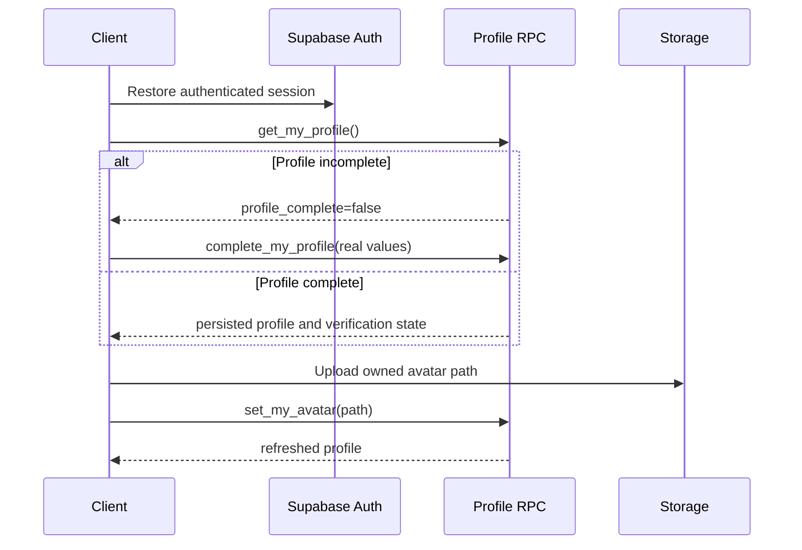

# Workflows

## Authentication and Google OAuth

Google setup is not active until credentials/redirect URLs are supplied. Apple/X controls do not perform a fake action.

## Registration and password reset

Email signup creates an Auth user; the trigger creates the account/profile/membership. Unconfirmed accounts stay pending until Supabase verification completes. Recovery uses a Supabase email redirect and `updateUser`; there is no fixed application OTP.

## Customer request with optional AI

Safety-critical AI output displays escalation advice and publishes only a manual/open request; it does not automatically run worker selection.

## Matching and booking

AI may generate a display explanation but cannot modify the eligibility query or select a worker.

## Booking lifecycle

Every transition validates participant, current state/version, and required reason; an event row preserves history. Realtime refreshes both parties.

## Tracking and route ETA

The latest authorized worker point and request destination are sent to `route` in `[longitude, latitude]` order. OpenRouteService returns route GeoJSON, meters, and seconds. A route snapshot is stored for a booking party/admin. MapLibre renders the real route; straight-line distance is not used as ETA.

## Chat and translation

Conversation participants insert/read messages under RLS. Realtime publishes new messages. If participant locale differs, `ai-translate-message` checks participant access, returns an existing cached translation or generates one, and leaves the original untouched.

## Cash payment and wallet

GCash/card remain disabled until configured.

## Payout

The worker selects an owned payout method and submits a bounded amount/idempotency key. The RPC locks the wallet, moves available funds to locked state, and creates a pending request. An AAL2 administrator approves/rejects through `admin_decide_payout`; balances and ledger are updated transactionally.

## Review/moderation

After completion, a customer creates one bounded review and optional owned images. Votes/reports/replies are separate normalized rows. AI sentiment runs asynchronously for aggregate administrator reporting and stores topics/risk/confidence/provider metadata. Only the administrator moderation RPC publishes/hides content.

## Notification campaign

An administrator creates a draft, then an AAL2 publish RPC materializes delivery rows for the selected audience. Recipient notifications/read state and delivery metrics update through Realtime. External push delivery is not active.

## Report export

An AAL2 administrator selects a report type/format. `report-generate` creates a PROCESSING row, reads a bounded dataset, generates CSV/XLSX/PDF, uploads to the administrator UUID path in `report-exports`, and marks COMPLETED. Failures persist FAILED with a reason. Downloads use short-lived signed URLs.

## Error handling

Provider failures never fabricate AI, geocoding, payment, notification, or booking success.
## Profile completion and update

Email changes use Supabase Auth confirmation. Password changes use Auth first and record `password_changed_at` only after Auth succeeds. Missing historical password or session data is displayed as unavailable.
