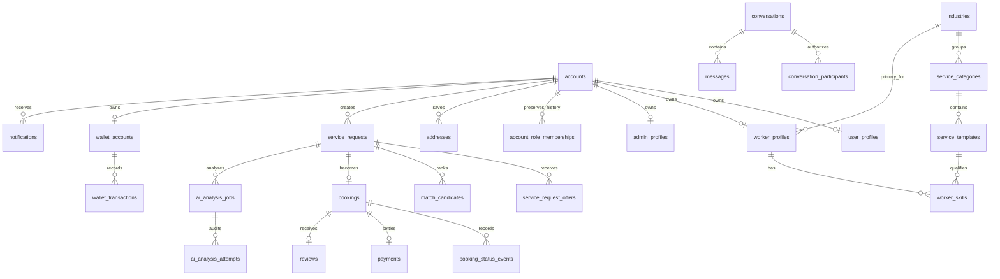

# Database Design

## Authority and migration strategy

Supabase PostgreSQL/PostGIS is the only data authority. The schema is defined by ordered files in `supabase/migrations`; clients do not create schema. Migrations `20260722000100` through `20260722000600` add the approved frontend compatibility layer, permanent single-role enforcement, and normalized industry/skill taxonomy without deleting application records. Migration `20260722000600` idempotently reconciles the hosted project's pre-existing earlier `industries` shape. Hosted project `qsurouiyvisykjkgjqmz` is the deployed authority; its complete `public` and Storage schema has an empty diff from the canonical migration result.

Only stable categories, content, and settings are seeded. Users, profiles, requests, bookings, messages, payments, reviews, wallet activity, notifications, and AI jobs are never seeded as production sample data.

## Core entity relationships

## Domain tables

| Domain                        | Tables and views                                                                                                                                                                  | Integrity model                                                                                                                    |
| ----------------------------- | --------------------------------------------------------------------------------------------------------------------------------------------------------------------------------- | ---------------------------------------------------------------------------------------------------------------------------------- |
| Identity                      | `accounts`, historical `account_role_memberships`/`account_session_roles`, `user_profiles`, `worker_profiles`, `admin_profiles`, `authentication_events`, `admin_session_history` | Auth UUID keys, immutable primary role, inactive historical memberships, profile completion, no identity fallback                  |
| Catalog and worker capability | `industries`, `service_categories`, `service_templates`, `services` view, `worker_skills`, `worker_availability`, `worker_portfolio_items`, `worker_verifications`                | Ten ordered industries, 50 UUID-backed skills, primary-industry FK, transactional onboarding, verified capability and availability |
| Requests and matching         | `service_requests`, `request_media`, `match_candidates`, `service_request_offers`, `cancellation_reasons`, `cancellations`                                                        | Owner FKs, idempotent offers, PostGIS request point, bounded state transitions                                                     |
| Bookings and tracking         | `bookings`, `booking_status_events`, `location_updates`, `route_snapshots`                                                                                                        | Optimistic versioning, party authorization, PostGIS points, append-only events                                                     |
| Payments and wallets          | `payments`, `payment_attempts`, `cash_confirmations`, `receipts`, `wallet_accounts`, `wallet_transactions`, `wallet_topups`, `payout_destinations`, `payout_requests`, `refunds`  | Minor-unit amounts, idempotency keys, immutable ledger transactions, balanced holds/reversals                                      |
| Communication                 | `conversations`, `conversation_participants`, `messages`, `message_attachments`, `message_translations`, `notifications`, `notification_deliveries`, `push_subscriptions`         | Participant RLS, read timestamps, original-message preservation, per-recipient delivery state                                      |
| Support and review            | `support_tickets`, `support_ticket_messages`, `support_message_attachments`, `reviews`, `review_media`                                                                            | Participant/admin access, booking eligibility, moderation state                                                                    |
| AI and geospatial             | `ai_processing_consents`, `ai_analysis_jobs`, `ai_analysis_attempts`, `ai_analyses`, `geocoding_cache`, `route_snapshots`                                                         | Versioned consent, owner/idempotency checks, provider-attempt audit, expiring normalized cache                                     |
| Administration                | `system_settings`, `audit_logs`, `report_exports`, `content_pages`, `promotions`, `trash_entries`                                                                                 | AAL2-sensitive commands, append-only audit, private report files, guarded restore/delete                                           |

## Indexes and constraints

- Primary and foreign keys enforce account, request, booking, conversation, payment, and catalog ownership.
- Unique and partial unique indexes protect idempotency, one-profile-per-account, one-wallet-per-owner, one active offer per worker/request, and provider event replay.
- GiST indexes support `ST_DWithin` and `ST_Distance` over `geography(Point,4326)` columns.
- Check constraints bound enums, ratings, money ranges, latitude/longitude, media metadata, and lifecycle state.
- RLS is enabled for application tables. Security-definer functions use a fixed `search_path`, role/ownership checks, bounded inputs, and explicit grants.
- `worker_profiles.primary_industry_id` identifies the worker's selected industry; every onboarding `worker_skills.category_id` must reference an active category under that same active industry. Direct authenticated skill writes are revoked.

## Storage

All application buckets are private. Paths begin with the authenticated UUID and policies validate ownership and workflow membership. The compatibility migration adds `profile-avatars`; existing buckets retain request/review/support/verification/portfolio/payment/report assets. Clients store paths, not fabricated public URLs, and resolve authorized signed URLs when required.

## Rollback and hosted deployment

Local acceptance requires `supabase db reset`, `supabase test db`, and a generated-schema diff. Before the taxonomy rollout, hosted `public`, `private`, and `storage` schema/data snapshots were written outside the repository under `/Users/jhonfiel/Documents/A-YOS/.hosted-backups/20260722-primary-industry`. Migrations `20260722000500` and `20260722000600` were then applied in isolation; live REST and post-deployment schema dumps verified 10 industries, 50 active skills, both foreign keys, the validated onboarding RPC, select-only client access to `worker_skills`, and preservation of existing core category UUIDs.

On 2026-07-22, a second restricted schema/data/roles backup was captured under `/Users/jhonfiel/Documents/A-YOS/backups/supabase-qsurouiyvisykjkgjqmz-20260722`. The backup inventory includes Auth identities, application accounts/profiles, business tables, buckets, and Storage object metadata. A linked comparison of every canonical migration against hosted `public,storage` returned a zero-byte diff. Migration histories remain intentionally different; replay or history repair is prohibited while the resulting schemas are identical.
