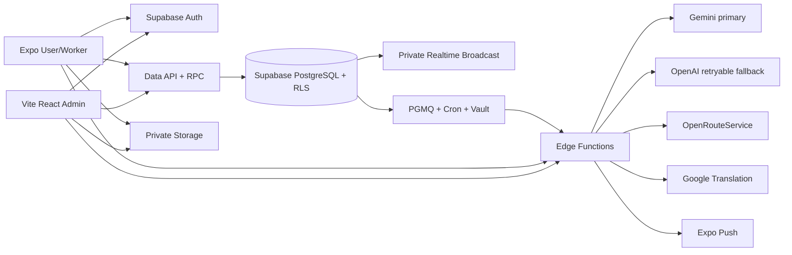

# System Architecture

## Overview

A-YOS uses Supabase as the application platform. The approved Expo and Vite clients authenticate through Supabase Auth, read authorized data through Data APIs, invoke transactional PostgreSQL RPC functions for protected workflows, upload to private Storage, and subscribe to Realtime channels. Edge Functions contain secret-bearing integrations only.

## Data and command boundaries

- PostgreSQL is authoritative. Foreign keys, checks, partial unique indexes, numeric money fields, and optimistic booking versions preserve integrity.
- RLS is enabled on every public application table. Reads enforce role, owner, booking party, conversation membership, moderation state, and administrator assurance.
- Low-risk profile, availability, address, favorite, message, and ticket operations use restricted column grants plus RLS.
- Matching, selection, booking transitions, location recording, payment confirmation, reviews, verification, refunds, content, settings, suspension, Trash, and Restore use security-definer RPCs.
- General Trash permanent deletion is restricted to an allowlist and requires AAL2, exact typed confirmation, retained-reference checks and auditing. The separate `admin_delete_account` RPC permanently deletes confirmed User or Worker accounts only when no retained business records reference them; Administrator/protected accounts are always rejected.

## Geospatial architecture

- PostGIS `geography(Point,4326)` is authoritative for worker service origins, saved-address coordinates, service-request location snapshots, and booking location updates. Numeric latitude/longitude values are generated projections for typed clients and Realtime payloads.
- GiST indexes support radius eligibility through `ST_DWithin`; `ST_Distance` supplies deterministic distance ordering after skills, approval, availability, and schedule eligibility. Recommendation priority is only a final tie-breaker.
- Expo uses one typed map contract with `maplibre-gl` on web and `@maplibre/maplibre-react-native` on Android/iOS. Maps consume GeoJSON rather than database-specific geometry values.
- Tracking reads use a security-definer booking-party RPC. Location writes are accepted only from the assigned Worker during the active travel/service states.

## Authentication and authorization

- Supabase owns passwords, email OTP verification/recovery, access tokens, refresh rotation, and session revocation.
- An `auth.users` trigger creates one immutable application role. User, Worker, and Administrator sessions are restricted to their matching workspace; historical secondary profiles and session-role rows cannot change authorization. Administrator creation requires service-controlled app metadata.
- Worker registration reads the public active `industries` taxonomy and nested active `service_categories`. The security-definer onboarding RPC validates UUIDs and membership, then writes `worker_profiles.primary_industry_id`, `worker_skills`, and verification data in one transaction; clients have no direct worker-skill mutation grant.
- Protected administrators are bootstrapped with the secret key and a hashed, ten-minute, single-use ticket consumed by the Auth provisioning transaction. The temporary raw ticket is cleared from Auth metadata after provisioning. Administrator self-registration and Administrator deletion are prohibited.
- Optional administrator authenticator-app TOTP replaces email 2FA. Sensitive administrator RPCs require AAL2 when MFA is enabled.
- Mobile persists sessions through the Supabase React Native storage adapter. The Vite administrator client uses Supabase persistent sessions and validates the Administrator account/profile before protected navigation. Secret/service-role keys never enter clients.

## Storage, realtime, and jobs

- Ten private buckets enforce owner-prefixed paths, MIME/size limits, membership, and administrator review, including profile avatars, top-up proofs, support attachments, and report exports.
- Realtime public access is disabled operationally; RLS protects status, location, conversation, and notification topics.
- Database triggers broadcast only committed changes.
- PGMQ queues booking timeouts, no-match notices, scheduled notifications, provider work, and Expo Push delivery. Cron invokes a secret-authenticated consumer using Vault values. Consumers retry five times, archive completed work, record terminal failures, audit delivery attempts, and retire invalid push tokens.

## Integrations and deployment

- AI analysis requires an authenticated owner and versioned consent, queues `ai_analysis_jobs`, validates private media and idempotency, and audits each provider attempt. Gemini is primary; OpenAI Responses is called only after eligible retryable Gemini failures. Permanent input, authorization, consent, and safety failures do not fall back.
- Forward/reverse geocoding and route geometry/ETA use authenticated OpenRouteService Edge Functions. Requests are Philippine-bounded, cached, validated, and persisted with the authoritative PostGIS point.
- Message translation uses Google Cloud Translation. Expo Push sends batches of at most 100, persists every ticket result, and retires `DeviceNotRegistered` tokens.
- Customer service settlement is Cash-only and requires both User and Worker confirmation. Worker top-ups use private manual GCash/bank proof and an AAL2 Administrator decision; ledger credit is idempotent. Payout funds are held and then completed or reversed transactionally with an external settlement reference.
- Local development uses Supabase CLI. Staging and production use separate hosted Supabase projects with migration-first deployment and generated types.
- Formal capacity, retention, backup, RPO, and RTO targets remain blocked by missing requirements. Supabase project backup/PITR settings must be selected before production acceptance.

## Testing architecture

- pgTAP validates schema, RLS, Storage, RPCs, role scenarios, and domain invariants on the local Supabase stack.
- Vitest validates shared contracts, static security controls, calculations, ranking, state transitions, redaction, and traceability.
- Mobile/admin E2E suites cover Auth, TOTP, worker approval, matching, booking, cash closure, reviews, support, and administration when a test Supabase stack is available.
