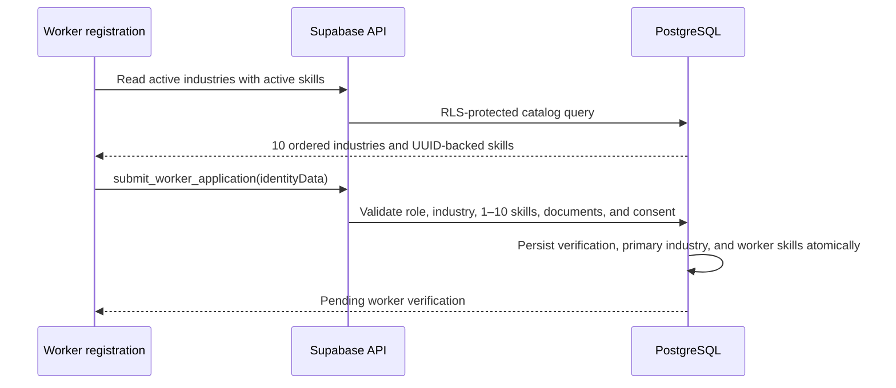

# Workflows

## Worker industry and skill selection

The industry suggestions are bounded and scrollable across web and native clients. Changing the selected industry clears incompatible client selections. Custom text is never submitted as a category identifier, and failed validation leaves the previously persisted worker taxonomy unchanged.

## User/Homeowner workflow

**Actor:** new or registered user. **Precondition:** required content and network/provider availability.

1. Launch → Splash → Landing → Already registered?
2. New user: registration details → accept Terms → email OTP → valid code activates and signs in. Invalid/expired/provider failures show retryable outcomes.
3. Registered user: email/mobile + password → optional recovery code → Home.
4. The immutable `USER` role permits only the customer workspace; worker routes redirect back to Home.
5. Home exposes Browse, Send Request, Bookings, Messages, Alerts, Profile, and optional AI Home Assistant. It searches the live service catalog, shows the first 8 matches, and reveals 4 more per See more action.
6. Browse supports featured/recommended/recent, search/filter/sort/category, worker details, top-five comparison, preselection messaging, and worker selection.
7. Request creation searches the live catalog, shows the first 4 matches, reveals 4 more per See more services action, and preserves the selected service UUID. Address suggestions or GPS confirm the required map point; reverse-provider failure retains a confirmed GPS point for manual address text. Specific field errors precede optional consent-based AI analysis or manual continuation.
8. If no suitable worker exists, adjust filters/date; AI-created requests remain open for later notification.
9. Selected worker receives a private request and accepts or declines with a reason. Offline/decline/timeout recommends another worker.
10. Booking follows Pending → Accepted → Worker Preparing → Worker En Route → Worker Arrived → Service Started → In Progress → Completed, or Cancelled with reason/policy/confirmation.
11. En-route tracking requests permission. Granted shows map/ETA; denied explains the limitation and supports retry. Active booking offers Call, Chat, and Emergency actions.
12. Completed booking uses Cash. User confirms cash paid; worker confirms receipt; success generates receipt and closes payment. Failure allows retry.
13. Completed-and-paid booking enables star rating, text, images, recommendation, and submitted result, subject to moderation.

Related requirements: FR-01–04, FR-10–18, FR-25–48, FR-49, FR-52–62, FR-73, FR-75–81, FR-89–101, FR-104. **Status:** connected in Expo; authenticated lifecycle, native device, and external route/ETA acceptance remain unverified.

## Worker workflow

**Actor:** worker account. **Precondition:** verified email; administrator approval before accepting jobs.

1. Create a dedicated `WORKER` account, verify its email, then complete categories, experience, service area, availability, identity information, and document submission.
2. Administrator approves, requests documents, or rejects. Approval activates job acceptance without a verification fee.
3. Dashboard exposes the existing Job Posts, Bookings, Reviews, Wallet, Portfolio and Profile workflows. No supplied Worker reference exists, so existing Worker UX is preserved.
4. Job Posts show only authorized suitable requests. Worker accepts or declines with a reason.
5. Accepted booking is prepared, travelled to, performed, and completed through canonical states; contact/tracking are permission- and participant-scoped.
6. Worker confirms cash received. After successful payment, worker sees customer feedback read-only.
7. Profile maintains professional details. Customer routes reject the immutable Worker role. Recommendation priority is administrator-controlled; advertising and premium purchase are excluded.

Related requirements: FR-05–09, FR-15–17, FR-42–43, FR-50–51, FR-58–59, FR-82–88, FR-102–104. **Status:** connected in Expo; authenticated lifecycle and native-device acceptance remain unverified.

## Administrator workflow

**Actor:** protected administrator. **Precondition:** Supabase service-role bootstrap account and valid credentials; authenticator-app TOTP/AAL2 when enabled.

1. Login validates credentials and optional second factor, then opens Dashboard.
2. Account Management covers profile, password/email, 2FA, login history, logout, users, workers, details, approval/document requests, suspension, recommendation priority, and confirmed deletion of eligible User/Worker accounts. Deletion rejects Administrators and accounts with retained business records.
3. System Administration covers audit logs, Trash, Restore, allowlisted AAL2 permanent deletion/empty-trash, and saved/discarded settings.
4. Communication creates notifications for users, workers, or everyone and sends/schedules them.
5. Business Intelligence provides reports, analytics, export, and print.
6. Customer Support provides ticket details, review moderation, escalation, resolution, and closure.
7. Financial Management provides transactions, cash details, and processed/rejected refunds.
8. Operations provides booking details, intervention/resolution, and services management.
9. Shared controls provide search, filters, pagination, exports, notifications, confirmations, and success/error outcomes.

Related requirements: FR-19–24, FR-31, FR-63–72, FR-74. **Status:** connected in the approved Vite/React administrator application; authenticated AAL2 mutation acceptance remains unverified.

## AI Home Assistant workflow

**Actor:** user. **Precondition:** authenticated active User; media permission for selected image/voice inputs; configured provider secrets for production calls.

1. Open assistant → provide text, choose an image, or record voice → accept the versioned per-request AI consent or continue manually.
2. The authenticated Edge Function validates ownership/media/idempotency, creates a queued job, and the client follows persisted status through Realtime.
3. Gemini analyzes the permitted inputs; eligible retryable failures fall back to OpenAI. The validated result contains the detected issue, severity, possible cause, suggested live category/service IDs, cost range, safety advice, questions, confidence, and editable draft.
4. Book a Professional creates an editable request draft; otherwise save analysis/draft for later.
5. Standard matching, booking, canonical lifecycle, cash confirmation, feedback, and administration paths continue.
6. No match keeps the request open and notifies later when a suitable worker appears.

Gemini receives bounded retry attempts. OpenAI is used only after eligible retryable Gemini timeout, throttle, 5xx, or schema failures. Authorization, invalid input, missing consent, and safety/refusal failures do not trigger fallback. Both-provider failure preserves the manual request path. Every attempt is redacted and audited.

Related requirements: FR-11–18, FR-25–31, FR-41–43, FR-57–59, FR-92–98, FR-104. **Status:** analysis, save, and request continuation are connected; live-provider and authenticated end-to-end verification are blocked by credentials/fixtures.
