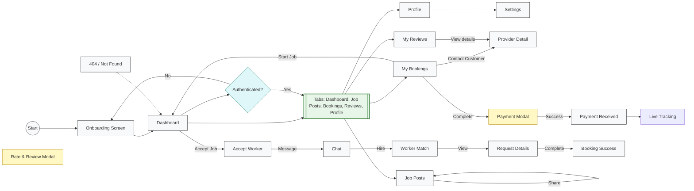

# A-yos — Worker Flow

This file contains a high-level worker-flow diagram for the A-yos **service-provider** app. For the user/customer flow, see [user-flow.md](./user-flow.md). For registration and sign-in flows, see [auth-flow.md](./auth-flow.md).

Design target: iPhone 15 / 393×852 dp. Colors and tokens are defined in `constants/theme.ts`.

Palette (key tokens):

- Primary / CTA: `#071022`
- Primary Light: `#1A2B4C`
- Success: `#117A5C`
- Warning: `#F59E0B`
- Error: `#C53030`
- Info: `#0B63D6`
- Background: `#F8F9FB`

## Architecture

The application has separate **User** and **Worker** accounts. An authenticated Worker can access only the worker navigator; customer routes reject the Worker role.

| Mode | Tab Navigator | Tabs |
|------|---------------|------|
| User | `(tabs)` | Home, Browse, Bookings, Profile |
| Worker | `(worker)` | Dashboard, Job Posts, Bookings, Reviews, Profile |

Shared screens (accessible from both modes): Provider Detail, Booking, Payment, Tracking, Review Modal.

## Screen Inventory

| # | Screen | Route | Parent | Presentation | Shared with User? |
|---|--------|-------|--------|--------------|-------------------|
| 1 | Dashboard | `/(worker)/` | Tab | tab | No |
| 2 | Job Posts | `/(worker)/search` | Tab | tab | Yes (search) |
| 3 | My Bookings | `/(worker)/bookings` | Tab | tab | Yes (bookings) |
| 4 | My Reviews | `/(worker)/reviews` | Tab | tab | No (hidden from user nav) |
| 5 | Profile | `/(worker)/profile` | Tab | tab | No |
| 6 | Settings | `/(worker)/settings` | Stack | modal | No |
| 7 | Provider Detail | `/provider/:id` | Stack | slide_from_right | Yes |
| 8 | Schedule Booking | `/booking/:id` | Stack | slide_from_right | Yes |
| 9 | Payment | `/payment` | Stack | modal | Yes |
| 10 | Payment Received | `/payment-received` | Stack | modal | Yes |
| 11 | Live Tracking | `/tracking/:id` | Stack | slide_from_right | Yes |
| 12 | Rate & Review | `/review/:id` | Stack | modal | Yes |
| 13 | Accept Worker | `/accept-worker/:id` | Stack | slide_from_right | Yes |
| 14 | Chat | `/chat/:id` | Stack | slide_from_right | Yes |
| 15 | Worker Match | `/match/:id` | Stack | slide_from_right | Yes |
| 16 | Request Details | `/request/:id` | Stack | slide_from_right | Yes |
| 17 | Booking Success | `/new-request/success` | Stack | modal | Yes |
| 18 | 404 | `+not-found` | Stack | default | Yes |

## Mermaid Diagram

## Tab Details

### Dashboard (`/(worker)/index.tsx`)

Header shows worker greeting, notification bell, category badge, and experience badge.

| Section | Content | Details |
|---------|---------|---------|
| Today's Overview | 2×2 stat grid | Active Jobs (2), Pending (3), Completed (5), Earnings ($180) |
| Active Bookings | 3 booking cards | Customer avatar, name, service, time, address, status badge |

**Actions:** Tapping a booking card navigates to the Bookings tab (`router.push('/(worker)/bookings')`).

---

### Job Posts (`/(worker)/search.tsx`)

| Section | Content | Details |
|---------|---------|---------|
| Search bar | Text input | Filters by customer name, service, and description |
| Filter chips | All, Urgent, Nearby, High Pay | Urgent: `urgency === 'urgent'`; Nearby: `distance <= 1.5 mi`; High Pay: `price >= $100` |
| Sort chips | Nearest, Highest Pay, Most Recent | Default: Nearest |
| Job post cards | FlatList of 4 posts | LinkedIn-style cards with image preview, comments, and share |

**Job Post Card Features:**

| Feature | Details |
|---------|---------|
| Author header | Avatar, customer name, posted time, urgency badge |
| Content | Service title, description, image preview (16:9) |
| Meta row | Location (left), price (right) — space-between |
| Action bar | Comment button with count (left), Share button (right) — space-between |
| Comment section | Newest/Oldest sort toggle, comment input with description + min/max price range |
| Offer badge | Green pill showing `$min - $max` offer range |

**Actions:** Workers can comment on posts with an offer (description + price range). New comments appear at top immediately.

---

### My Bookings (`/(worker)/bookings.tsx`)

| Section | Content | Details |
|---------|---------|---------|
| Filter tabs | Upcoming, In Progress, Completed, Cancelled | Horizontal chip row |
| Booking cards | FlatList of 5 bookings | Customer avatar, name, service, status badge, date, time, address, price |

**Actions by status:**

| Status | Buttons |
|--------|---------|
| Upcoming | "Contact" (phone icon) + "Start Job" (CTA) |
| In Progress | "Complete" (CTA) |
| Completed | "Paid · {price}" text (no button) |
| Cancelled | Status badge only (no buttons) |

All buttons are visual placeholders — handlers not yet implemented.

---

### My Reviews (`/(worker)/reviews.tsx`)

| Section | Content | Details |
|---------|---------|---------|
| Rating Summary | Large average rating + star display + total count | Computed from mock data (avg: 4.8) |
| Star Distribution | 5-to-1 bar chart | Visual distribution of ratings |
| Filter chips | All, 5 Stars, 4 Stars, 3 Stars, Recent | Toggle by rating or sort by date |
| Review cards | FlatList of 4 reviews | Customer avatar, author name, star rating, date, service tag, comment text |

**Actions:** "Helpful" thumb toggle per review (local state only — not persisted).

---

### Profile (`/(worker)/profile.tsx`)

| Section | Content | Details |
|---------|---------|---------|
| Profile Header | Avatar + edit overlay, name, email, verification badge, category, experience | Uses `workerProfile` from `workerData.ts` |
| Stats Row | 3-column card | Jobs Done (47), Rating (4.9), Earnings ($2,340) |
| Menu Section | 8 tappable rows | Work Experience, My Skills, Service Areas, Portfolio, Payout Methods, Notifications, Help & Support, Settings |
| Log Out | Red outlined button | Visual only |

## Worker Profile Data

Source: `constants/workerData.ts`

| Field | Value |
|-------|-------|
| Name | Carlos Mendez |
| Email | carlos.mendez@email.com |
| Category | Master Plumber |
| Experience | 12 years |
| Rating | 4.9 |
| Total Reviews | 127 |
| Completed Jobs | 47 |
| Total Earnings | $2,340 |

## User Journey

1. **Launch** → Onboarding (not yet implemented) → Dashboard tab
2. **View stats** → Dashboard shows today's overview (active, pending, completed, earnings)
3. **Find work** → Job Posts tab → Filter by urgency/distance/pay → Sort → View posts with images → Comment with offer → Share
4. **Manage bookings** → Bookings tab → Filter by status → Start Job / Complete / Contact Customer
5. **Read reviews** → Reviews tab → Filter by stars → Toggle helpful
6. **View profile** → Profile tab → Stats, menu items, edit avatar

## Shared Screens Between Roles

These screens are accessible from both User and Worker tabs via stack navigation:

| Screen | Route | Used by Worker |
|--------|-------|----------------|
| Provider Detail | `/provider/:id` | View from Reviews tab |
| Payment | `/payment` | Complete booking flow |
| Payment Received | `/payment-received` | Success confirmation |
| Live Tracking | `/tracking/:id` | View active job progress |
| Rate & Review | `/review/:id` | Leave review for customer |
| Accept Worker | `/accept-worker/:id` | Accept incoming job request |
| Chat | `/chat/:id` | Message customer before hiring |
| Worker Match | `/match/:id` | View matched workers |
| Request Details | `/request/:id` | View request details and bidders |
| Booking Success | `/new-request/success` | Booking confirmation |

---

## Mock Data Locations

| Screen | Data | Source |
|--------|------|--------|
| Dashboard | `todayStats`, `activeBookings`, `workerProfile` | Inline in `app/(worker)/index.tsx` + `constants/workerData.ts` |
| Job Posts | `workerJobs`, `jobComments`, `filterOptions`, `sortOptions` | `constants/workerMockData.ts` + inline in `app/(worker)/search.tsx` |
| Bookings | `mockWorkerBookings`, `filterTabs`, `statusConfig` | Inline in `app/(worker)/bookings.tsx` |
| Reviews | `mockWorkerReviews`, `filterOptions` | Inline in `app/(worker)/reviews.tsx` |
| Profile | `workerProfile`, `menuItems`, `verificationConfig` | `constants/workerData.ts` + inline in `app/(worker)/profile.tsx` |
